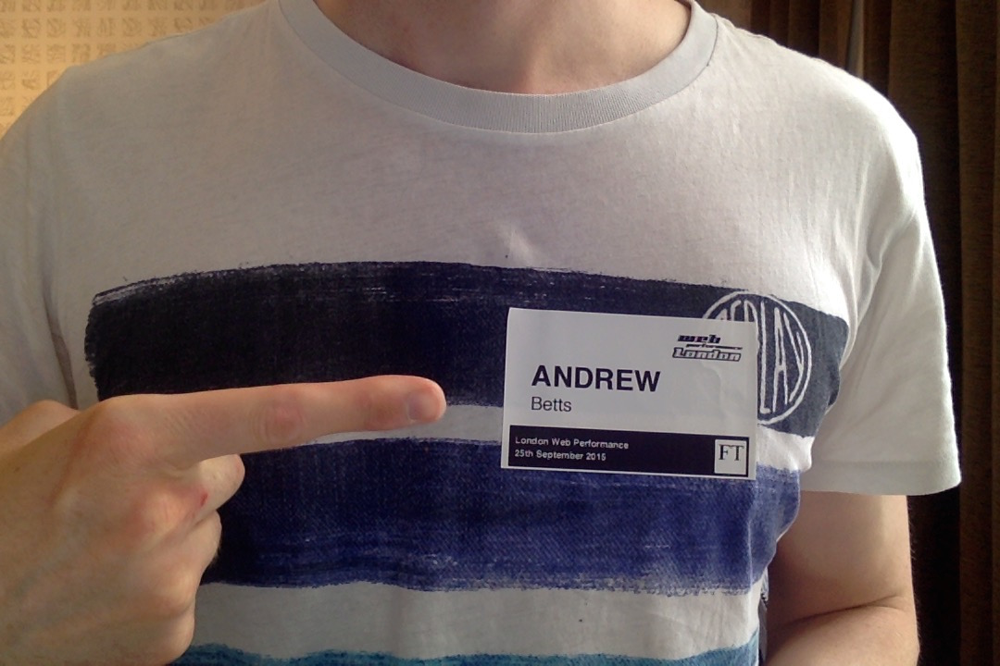

# Badge printing script for eventbrite events

Polls the eventbrite API for new checkins.  When a person checks in for the first time, creates a PDF of a name badge, and prints it on a locally attached Brother QL-570 printer.

Note that Eventbrite has rate limits on the API.  Be sure that the limit is sufficient for your needs.  The app will exit if it hits the rate limit.

To run:

1. Clone
2. npm install
3. Create a `.env` file or set appropriate env vars (see below)
4. Make sure printer is turned on, plugged in, and is stocked with labels
5. Run `npm start`

## Config

Configure the app via env vars as follows:

* `IPP_PRINTER_URL`: IPP URL for the printer.  Can be discovered by running `lpstat -p -d`.  Append the printer name to `ipp://localhost/printers/`.
* `EB_EVENT_ID`: (optional) Eventbrite event ID, as a string.  If not provided, will use the next upcoming event organised by you.  Generally better not to set this unless you have multiple events starting at the same time.
* `EB_OAUTH_TOKEN`: Eventbrite Oauth token
* `EVENT_NAME` (optional): Name of event.  If omitted, the event name from Eventbrite will be used
* `DEBUG` (optional): Configuration for the [debug](https://github.com/visionmedia/debug) node module.  To see all debug output, set to `*`.  If not set the app will produce no output.
* `PORT` TCP port on which to run a web server for status dashboard (default 3006)

## Web server

The app creates a web server which displays the guestlist and current checkin status of each person, which is updated in real time using Server-sent events when people check in.  As a fun extra it also greets each person with a random greeting.
